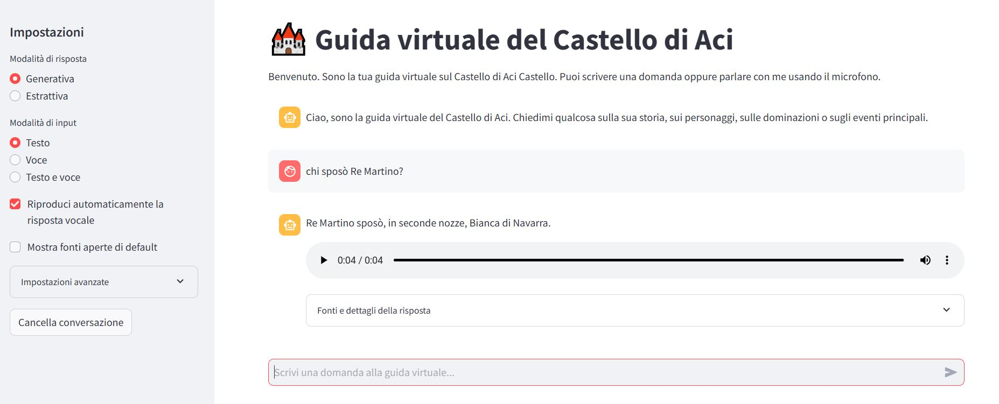

# RAG-based Question Answering System for the Norman Castle of Aci Castello

This project implements a Retrieval-Augmented Generation system for answering questions about a historical text related to the Norman Castle of Aci Castello.

The system uses semantic embeddings, FAISS vector search, optional reranking, and both extractive and generative answer generation. The application is developed in Python with Streamlit and deployed on Hugging Face Spaces.

<p align="center">
  
</p>

## Main Features

- Text chunking and semantic embedding generation
- FAISS-based vector retrieval
- Optional reranking of retrieved chunks
- Extractive Question Answering with a BERT-based reader
- Generative answer generation with an LLM
- Evaluation on a SQuAD-like dataset
- Streamlit web interface
- Deployment on Hugging Face Spaces

## Webapp

The deployed webapp is available at:

[Hugging Face Space](https://huggingface.co/spaces/lorelarocca2001/guida-castello-aci)


## Repository Structure

The repository is organized as follows:

- `app/`: contains the Streamlit web application and the Python modules used to run the RAG pipeline.
- `assets/`: contains static resources, including screenshots and demo videos of the Streamlit web application.
- `data/`: contains the source data used by the system, including the text chunks and the SQuAD-like QA evaluation dataset.
- `indexes/`: contains the FAISS vector index and the associated metadata used for semantic retrieval.
- `notebooks/`: contains the development and experimentation notebooks used to build, test, and evaluate the RAG system.
- `results/`: contains the experimental outputs, evaluation metrics, reader comparisons, retrieval analysis, and visualizations.


## How to Run

```bash
pip install -r requirements.txt
streamlit run app/main.py
